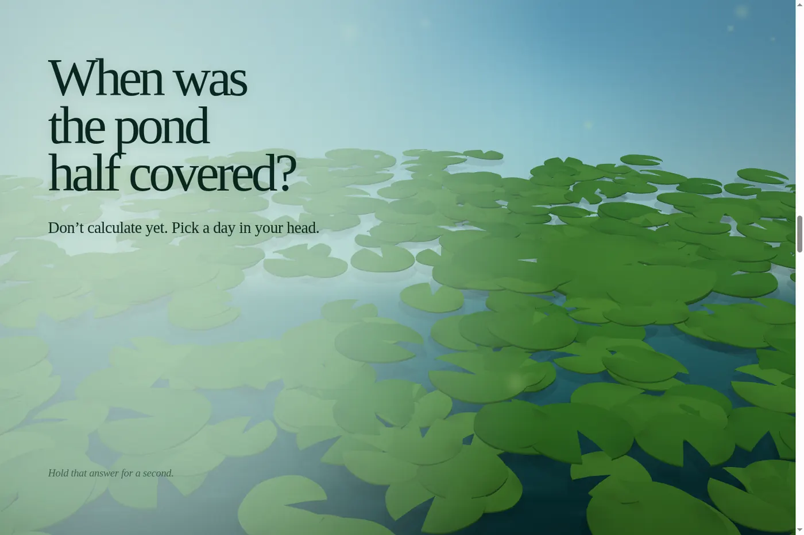
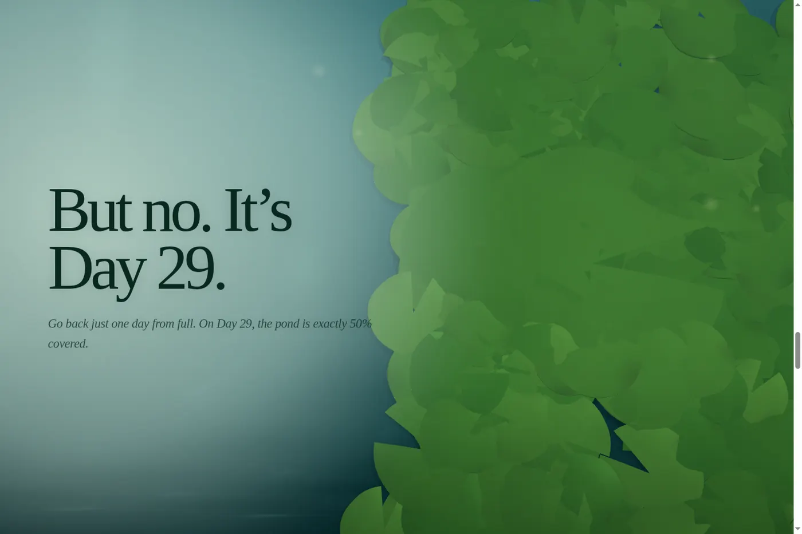
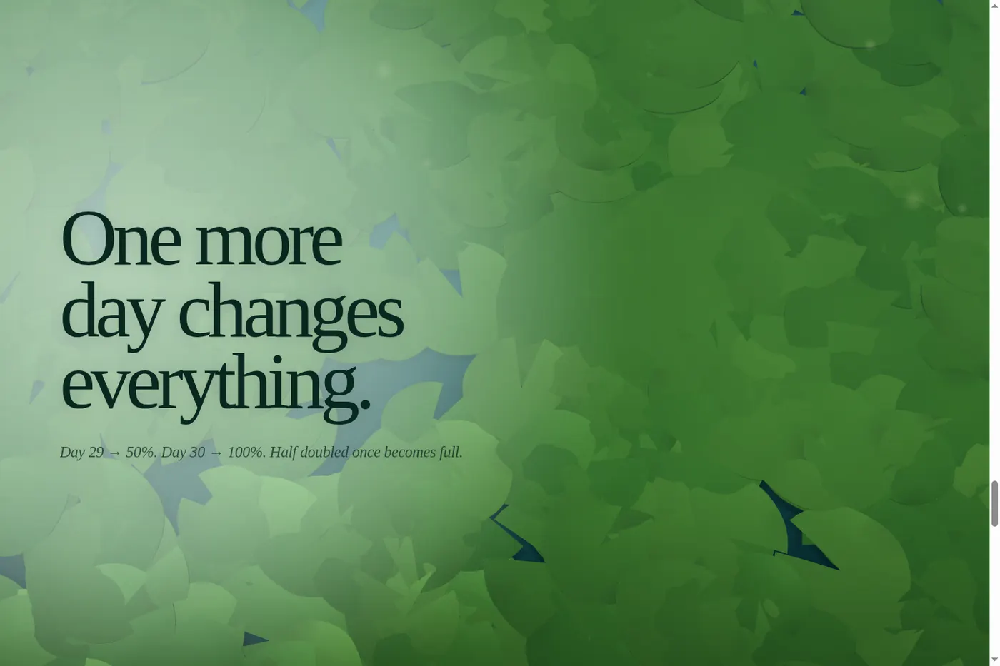

# Thirty Mornings

A cinematic, scroll-driven 3D experience built around the classic 30-day lily-pad riddle.

The visitor watches a lily patch double across a pond, gets a quiet moment to form an answer, then sees why **Day 29** — not Day 15 — is the halfway point. The ending connects the exponential-growth idea to patience and compounding in real life.



## The idea

A patch of lily pads doubles every day. On Day 30 the pond is completely covered.

**When was it half covered?**

The intuitive answer is often around Day 15. The actual answer is **Day 29**: 50% doubled once becomes 100%.



## What makes this project different

- Real-time WebGL pond with perspective camera movement and depth-tested 3D lily pads.
- Organic pad geometry with thickness, surface detail, normals, lighting and floating motion.
- Procedural full-screen water shader instead of a finite plane, preventing visible scene edges.
- Scroll position drives the narrative, camera and mathematical growth state together.
- Exact exponential model: Day 29 = 50%, Day 30 = 100%.
- Responsive desktop/mobile composition.
- `prefers-reduced-motion` support.
- Animated non-WebGL fallback.
- No analytics, remote fonts, APIs, runtime CDN assets or environment variables.
- Classic production bundle so the site can also be opened directly from `index.html`.

## Stack

- HTML
- CSS
- vanilla JavaScript
- WebGL
- Node.js build/verification scripts

There are no runtime npm dependencies.

## Project structure

```text
.
├── .github/workflows/
│   ├── ci.yml
│   └── pages.yml
├── checks/
├── docs/screenshots/
├── scripts/
├── src/
├── index.html
├── package.json
└── README.md
```

## Run locally

Requires Node.js 22+.

```bash
npm ci
npm run build
npm run serve
```

Open `http://127.0.0.1:8000`.

You can also open `index.html` directly in a normal desktop browser because the production bundle is a classic local script.

## Verify

```bash
npm run verify
```

The verification suite checks story structure, exact Day 29/30 math, responsive and reduced-motion CSS contracts, the WebGL/procedural-water implementation, unsafe runtime URLs, secret-like values and production build output.

## Deploy to GitHub Pages

Deployment is intentionally **manual** so uploading this repository does not publish anything by itself.

1. Push the repository to GitHub.
2. Open **Settings → Pages** and choose **GitHub Actions** as the source if GitHub asks.
3. Open **Actions → Deploy to GitHub Pages**.
4. Click **Run workflow**.

The workflow runs the verification suite first and publishes only `dist/`.

## CI

Every push and pull request runs:

```bash
npm ci
npm run verify
```

## Design direction

This is intentionally not a normal landing page. There is no navbar, features grid, pricing section or dashboard UI. The pond is the interface and the copy behaves like a riddle being asked in real time.

The ending is framed as an analogy rather than a guarantee: meaningful progress can remain hard to see for a long time, especially when growth compounds.



## License

No software license has been selected yet. That is deliberate: choosing a license changes the reuse rights granted to other people. Add a license before you intentionally grant public reuse or modification rights.
